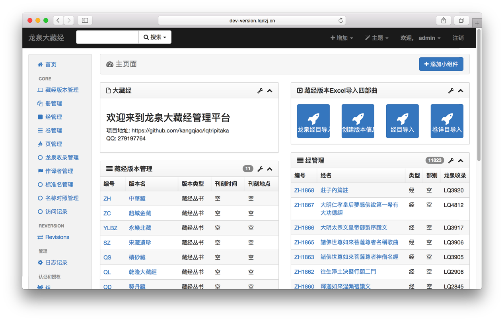
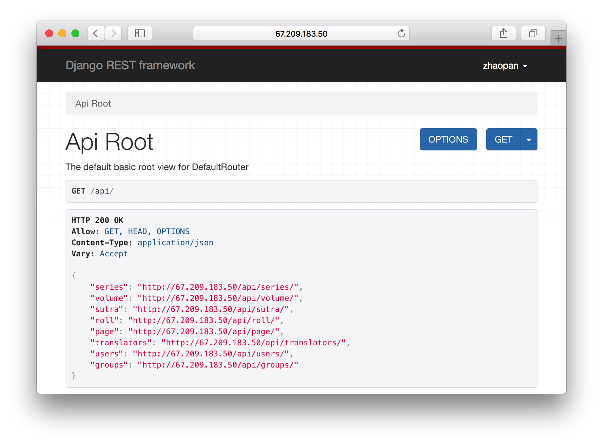

# 龙泉大藏经

中国佛教典籍资料，不仅是世界佛教的宝藏，也是人类文明的瑰宝。考虑到中国佛教在新世纪里作为全球佛教发展中心的地位与使命，对中国佛教典籍进行系统、规范的现代整理，就成为当务之急。为此，师父在开示中指出：“汉文大藏经的校勘、整理、研究、翻译，不仅是建立汉传佛教完整修学体系的根基，而且是创新当代佛教思想理论、复兴传播中华文化乃至融合东西方文化的重要起点。

欢迎加入龙泉大藏经平台开发.

QQ: 279197764

Demo:
 
 [后台管理入口](http://dev-version.lqdzj.cn/xadmin/)  
 [REST API 接口列表](http://dev-version.lqdzj.cn/api/)


[生产环境部署文档](./Deployment.md)


## 开发环境部署

### 环境
- Python 3.6.1
- Django 1.11.2
- xadmin 0.6.1

[Dependent packages](./requirements.txt)

### Install
通过virtualenv安装依赖包
```
~ git clone git@github.com:kangqiao/lqtripitaka.git
~ cd lqtripitaka
~ mkvirtualenv --no-site-packages --python=python3.5 lqtripitaka
~ pip install -r requirements.txt
```
##### Xadmin Install
由于pip中xadmin与python3存在兼容问题.
使用pip从[github xadmin](https://github.com/sshwsfc/xadmin)安装最新版本.
```
~ pip uninstall xadmin
~ pip install git+https://github.com/sshwsfc/xadmin.git
```
##### Fix mysql bug
PyMySQL需要在项目设置包中settings.py 中增加:
```
import pymysql
pymysql.install_as_MySQLdb()
```

### Create admin
```
~ cd lqtripitaka
~ python manage.py createsuperuser
username: admin
e-mail: admin@126.com
password: admin 
```

### Initialization
```
~ cd lqtripitaka
~ workon lqtripitaka #激活已创建的lqtripitaka环境
~ export DJANGO_SETTINGS_MODULE=setting.settingsdev 
~ python manage.py makemigrations
~ python manage.py migrate
# 加载初始数据
~ python manage.py loaddata data.json
# Collect media:
~ python manage.py collectstatic
~ python manage.py runserver
```

Open [http://127.0.0.1:8000](http://127.0.0.1:8000) and [http://127.0.0.1:8000/api](http://127.0.0.1:8000/api) in your browser, the admin user password is admin





```
////////////////////////////////////////////////////////////////////
//                          _ooOoo_                               //
//                         o8888888o                              //
//                         88" . "88                              //
//                         (| ^_^ |)                              //
//                         O\  =  /O                              //
//                      ____/`---'\____                           //
//                    .'  \\|     |//  `.                         //
//                   /  \\|||  :  |||//  \                        //
//                  /  _||||| -:- |||||-  \                       //
//                  |   | \\\  -  /// |   |                       //
//                  | \_|  ''\---/''  |   |                       //
//                  \  .-\__  `-`  ___/-. /                       //
//                ___`. .'  /--.--\  `. . ___                     //
//              ."" '<  `.___\_<|>_/___.'  >'"".                  //
//            | | :  `- \`.;`\ _ /`;.`/ - ` : | |                 //
//            \  \ `-.   \_ __\ /__ _/   .-` /  /                 //
//      ========`-.____`-.___\_____/___.-`____.-'========         //
//                           `=---='                              //
//      ^^^^^^^^^^^^^^^^^^^^^^^^^^^^^^^^^^^^^^^^^^^^^^^^^^        //
//                         南无阿弥陀佛                            //
////////////////////////////////////////////////////////////////////

```
