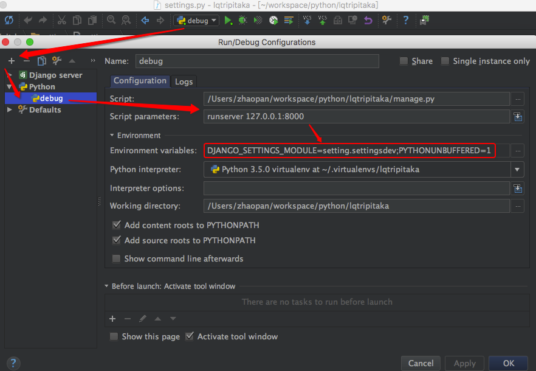

# 龙泉藏经版本管理系统

藏经版本管理系统的建设旨在支持藏经办版本整理业务过程，实现当代现存各版本大藏经的收集、录入、展示、信息管理，并为后续藏经校勘系统提供所需要的校勘数据。藏经版本管理系统的第一阶段将基于藏经办目前的整理工作，设计合理、可行的藏经数据存储格式和存储方式，建立藏经版本库，并实现对各种藏经版本的数据及文件导入、多维度展示、信息管理等功能。第二阶段将基于已建立的版本库系统，扩充藏经版本的采集、甄别、GIS展示等功能，并将上述业务所涉及的信息与版本库进行集成。系统建成后，将实现藏经版本整理业务过程的规范化、自动化、信息化，显著提高藏经版本整理工作的效率和质量。

欢迎加入龙泉大藏经平台开发.

QQ: 279197764

#### [Docker 生产环境部署文档](./Deployment.md)

#### 开发环境:
- [版本管理管理入口](http://dev-version.lqdzj.cn/xadmin/)  admin/admin
- [版本REST API 接口列表](http://dev-version.lqdzj.cn/api/)


### 开发环境部署

##### 环境
- Django 1.11.2
- xadmin 0.6.1
- Mysql 5.7

[Dependent packages](./requirements.txt)

##### Install
通过virtualenv安装依赖包
```
~ git clone git@github.com:kangqiao/lqtripitaka.git
~ cd lqtripitaka
~ mkvirtualenv --no-site-packages --python=python3.5 lqtripitaka
~ pip install -r requirements.txt
```
##### Xadmin Install
由于pip中xadmin与python3存在兼容问题.
使用pip从[github xadmin](https://github.com/sshwsfc/xadmin)安装最新版本.
```
~ pip uninstall xadmin
~ pip install git+https://github.com/sshwsfc/xadmin.git
```
##### Fix mysql bug
PyMySQL需要在项目设置包中settings.py 中增加:
```
import pymysql
pymysql.install_as_MySQLdb()
```

##### Create admin
```
~ cd lqtripitaka
~ python manage.py createsuperuser
username: admin
e-mail: admin@126.com
password: admin 
```

##### Initialization
```
~ cd lqtripitaka
~ workon lqtripitaka #激活已创建的lqtripitaka环境
~ export DJANGO_SETTINGS_MODULE=setting.settingsdev 
~ python manage.py makemigrations
~ python manage.py migrate
# 加载初始数据
~ python manage.py loaddata data.json
# Collect media:
~ python manage.py collectstatic
~ python manage.py runserver
```


Open [http://127.0.0.1:8000](http://127.0.0.1:8000) and [http://127.0.0.1:8000/api](http://127.0.0.1:8000/api) in your browser, the admin user password is admin

### 展示:


```
////////////////////////////////////////////////////////////////////
//                          _ooOoo_                               //
//                         o8888888o                              //
//                         88" . "88                              //
//                         (| ^_^ |)                              //
//                         O\  =  /O                              //
//                      ____/`---'\____                           //
//                    .'  \\|     |//  `.                         //
//                   /  \\|||  :  |||//  \                        //
//                  /  _||||| -:- |||||-  \                       //
//                  |   | \\\  -  /// |   |                       //
//                  | \_|  ''\---/''  |   |                       //
//                  \  .-\__  `-`  ___/-. /                       //
//                ___`. .'  /--.--\  `. . ___                     //
//              ."" '<  `.___\_<|>_/___.'  >'"".                  //
//            | | :  `- \`.;`\ _ /`;.`/ - ` : | |                 //
//            \  \ `-.   \_ __\ /__ _/   .-` /  /                 //
//      ========`-.____`-.___\_____/___.-`____.-'========         //
//                           `=---='                              //
//      ^^^^^^^^^^^^^^^^^^^^^^^^^^^^^^^^^^^^^^^^^^^^^^^^^^        //
//                         南无阿弥陀佛                            //
////////////////////////////////////////////////////////////////////

```
